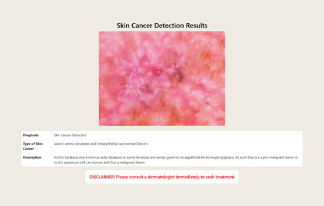

# Skin Cancer Detection Project

## Overview
The **Skin Cancer Detection Project** aims to evaluate and compare the performance of four deep learning models—CNN, MobileNetV3 Large, VGG16, and EfficientNetB4—for the automated detection and classification of skin lesions. The goal is to determine the most effective model for early skin cancer diagnosis, improving healthcare.

## Features

### 1. Performance Evaluation
- Assess the effectiveness of each deep learning algorithm in detecting skin lesions.
- Compare model accuracy, training efficiency, and classification performance.

### 2. Model Implementation
- Implement a CNN alongside pre-trained models (MobileNetV3 Large, VGG16, EfficientNetB4).
- Utilize transfer learning to fine-tune pre-trained models for skin cancer classification.
- Train models using TensorFlow and Keras in Google Colab.

### 3. Web Application Integration
- Develop a website linked to the trained model.
- Assist doctors in making informed decisions by providing automated skin cancer detection.

## Dataset
**- The Skin Cancer Detection Project** utilizes the skin-cancer9-classesisic dataset, which comprises 10,015 dermatoscopic images categorized into nine classes of skin lesions. 
- For more information and access to the dataset, you can visit dataset page on Kaggle.
- **Dataset URL:** [Skin Cancer 9 Classes (ISIC)](https://www.kaggle.com/datasets/nodoubttome/skin-cancer9-classesisic)
- The dataset consists of labeled images of skin lesions categorized into **nine different classes**.
- It includes **high-resolution dermatoscopic images** collected from public medical image datasets.
- Images are preprocessed using **normalization, data augmentation, and resizing** for optimal model performance.
- The dataset is split into **training, validation, and testing sets** to ensure proper evaluation and generalization.

## Models Used

### 1. CNN (Convolutional Neural Network)
- Achieved the highest validation accuracy of **95.78%**.
- Showed consistent improvement in accuracy over **25 epochs**.
- Utilized early stopping to prevent overfitting.

### 2. MobileNetV3 Large
- Achieved a final accuracy of **89.47%**.
- Improved steadily in performance over training epochs.
- Demonstrated good generalization to unseen data.

### 3. VGG16
- Achieved a validation accuracy of **86.39%**.
- Stopped training early at epoch **21** to prevent overfitting.
- Demonstrated strong performance in classification tasks.

### 4. EfficientNetB4
- Achieved a peak validation accuracy of **87.56%**.
- Implemented early stopping to maintain optimal performance.
- Showed a clear learning curve across **25 epochs**.

## Technologies Used
- **Programming Language:** Python
- **Deep Learning Framework:** TensorFlow, Keras
- **Libraries:** NumPy, Pandas, Matplotlib, Seaborn, Scikit-learn
- **Development Environment:** Google Colab

## Installation & Setup
1. Clone the repository:
2. Navigate to the project directory:
   ```bash
   cd Skin-Cancer-Detection
   ```
3. Install dependencies:
   ```bash
   pip install -r requirements.txt
   ```
4. Run the application:
   ```bash
   python app.py
   ```

## images of Web Application Interface 
- 
- 

